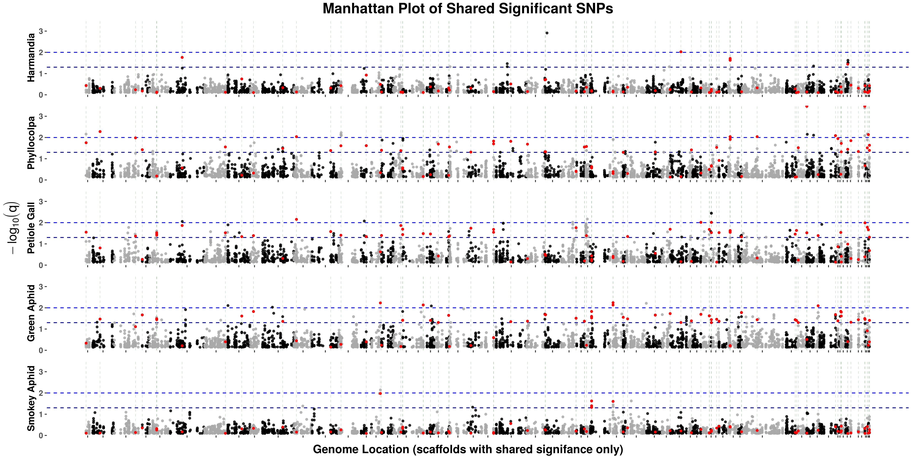

```{r setup, include = FALSE}
knitr::opts_chunk$set(echo = FALSE, message = FALSE, warning = FALSE,
                      eval.after = 'fig.cap')

knitr::opts_knit$set(root.dir = "../")
```

```{r load data, purl=FALSE}
library(dplyr)
# load data provided in knitr parameter

vars.list <- data(list = params$data)
tree.traits <- read.table("data/phenos-and-covars.txt",header = TRUE)
starting.objects <- ls()
# ins.env <- new.env()
# load("~/Documents/projects/community-analysis-WisAsp/data/r-objects.RData",
     # envir = ins.env)
```

# Introduction
<!-- Much of this is taken from my thesis proposal -->

<!-- clear statement of problem(s) being addressed, why doing so is 
interesting/important, -->

Plant-insect interactions have traditionally been viewed through the lens of 
single species interactions (one plant and one insect) or interactions between 
whole communities. In particular, the effects of interspecific variation 
have been a focal point of community ecology in general (Power et al 1996)
and in studies of plant-insect interactions. However, the contribution of 
intraspecific variation was largely ignored. In recent decades, more attention 
has been given to the effects that variation in individual species can have on 
entire associated communities (Des Roches et al 2017; Koricheva and Hayes 2018)
and a recent meta-analysis showed that intraspecific trait variation
contributed significantly (25%,on average) to plant community trait variation 
world-wide (Siefert et al 2015). 

The interest in single-species effects on communities led to the development of 
a new field of study: community genetics. Proposed by Antonovics (1992), 
community genetics explores the effects of intraspecific variation on 
communities. This approach provides a means to understanding plant-insect 
interactions more completely than historical approaches. Research in this 
field has determined that different plant genotypes can have a strong 
influence on the composition and diversity of associated insect communities
by way of phenotypic trait expression (Whitham et al 2003, 2008; 
Wimp et al 2005; Bangert et al 2008; Meneses et al 2012; Gosney et al 2017).
**However, specific phenotypic traits, and suites thereof, that most influence 
insect communities remain poorly understood.** Even relatively simple insect 
communities, with only a few constituent taxa, are likely impacted by many host
plant traits. Yet most plant-insect community genetics studies focus on only 
genotype differences and broad-sense heritability of communities without 
investigating the mechanisms that drive those differences. Studies in which
phenotypic trait data have been collected have considered only a few traits,
leaving an incomplete understanding of the complete phenotypic mechanisms 
through which genetic differences act on communities (Hersch-Green et al 
2011; Crutsinger 2016).

<!-- Proposal: -->
<!-- To address phenotypic mechanisms of genotype-based community effects, we propose -->
<!-- to evaluate the combined effects that plant genetics and traits have in  -->
<!-- shaping associated insect herbivore communities, using a *Populus*  -->
<!-- experimental system. To this end, we will use a model-based approach to test  -->
<!-- the collective effects of (1) *Populus tremuloides* (aspen) genotype at various  -->
<!-- SNPs, (2) various aspen traits including size and defense traits, and (3)  -->
<!-- various environmental factors including weather and time on the abundance of  -->
<!-- 18 common insect species. -->

To address phenotypic mechanisms of genotype-based community effects, we aim
to evaluate the combined effects that plant genetics and traits have in
shaping associated insect herbivore communities, using a *Populus* experimental
system. In one step towards this end, we conducted a model-based, genome-wide association analysis
of *Populus tremuloides*. We evaluated the effects of genotype at various SNP
genomic markers on incidence of 18 common insect species, accounting a variety
of traits and environmental factors that are known to affect insect communities.

# Background
<!--  background specifying what has been done in this area -->

## Community genetics: state of the field

The success of herbivorous insects is largely determined by physical and 
chemical characteristics of their host plants, many of which are genetically 
mediated (heritable). Even before the advent of community genetics, 
ecologists recognized that species genetics can influence communities. 
These effects were termed extended phenotypes (EP) (Dawkins 1982; 
Antonovics 1992), a term that is still used by community genetics 
investigators (Whitham et al 2003). Though plant genes do affect insect 
communities, they do not do so directly as in typical phenotypic expression. 
Instead, communities respond to plant phenotypes that are mediated by genes.
Phenotypic traits, then, are the mechanisms of community genetic 
effects (Hersch-Green et al 2011; Crutsinger 2016). 

<!-- Needed? -->
<!-- Morphological and  -->
<!-- physiological plant traits that are likely to influence insect performance  -->
<!-- are those that affect quality and availability of the plant as a food  -->
<!-- resource.The available quantitiesof suitable host plant species can have  -->
<!-- significant impacts on individual insects and insect communities.  -->
<!-- Plant biomass is positively correlated with total insect abundance  -->
<!-- (Haddad et al 2001)and increasing leaf biomass is linked toincreasing  -->
<!-- insect herbivore abundance and species richness (Marques et al 2000). -->
<!-- Drivers of that trend includespecific heritable plant traits such as  -->

Additionally, expression of individual traits can be constrained by other 
traits. High levels of expression in one trait can predispose a plant to low 
expression of a different trait. Co-expression of chemical defense and growth, 
for example, are limited by allocational and genetic costs (Sampedro 2014; 
Eichenberg et al 2015; Züst and Agrawal 2017). Therefore, the interaction of 
heritable plant traits, in addition to individual traits, may be key to 
shaping insect communities.

Many studies have shown genotype-mediated  differences among plant-associated
insect communities (Whitham et al 2003; Johnson and Agrawal 2005; 
Bangert et al 2006; Wimp et al 2010) but few have incorporated genetics and
phenotypic expression to do so. Fewer still have used a wide range of
naturally co-occurring genotypes and respective phenotypic variation. Studies 
meeting these criteria are needed to understand the capacity of a natural 
system for community genetic effects (Crutsinger 2016). Additionally, 
specific plant phenotypes and genotypes to which insect communities are most 
sensitive have not been investigated thoroughly in a community genetics 
context (with notable exceptions for phenotypes such as chemical defenses: see 
Gosney et al, 2017) (Hersch-Green et al 2011; Crutsinger 2016). Chemical, 
physical, and phenological plant traits, the genetic information that regulates
these traits, and their interactions, all influence the structure and 
composition of associated insect communities. It is, therefore, important 
to investigate the effects of multiple plant traits with high levels of 
intraspecific variation. Furthermore, it is important to study plants from a 
population of genetically variable and naturally co-occurring genets of a 
foundation species such as aspen.

<!-- Necessary section? -->
## **Populus tremuloides** as a study system  

Trembling aspen is an ideal species for studying the interactions between 
genetics, traits, and insects because of its role in shaping insect communities.
Community genetic effects of plants in a system are most likely to occur when: 
1) The plant is a foundation species in the system, 2) the plant species has 
high levels of heritable variation in many traits, and 3) communities (insects)
that are associated with the plant have many potential members that are 
differentially sensitive to plant traits (Antonovics 1992; Bailey et al 2006; 
Whitham et al 2006; Bangert et al 2008; Crutsinger 2016). Aspen satisfy all 
these criteria.

Aspen are considered a foundation species in North America and support some of 
the most biologically diverse communities in the US (Mitton and Grant 1996; Kay 
1997; Madritch et al 2009; Kuhn et al 2011). The importance of aspen as a driver 
of biodiversity is even more pronounced when the scale at which it acts is 
considered; aspen is the most widely distributed tree species in all of North 
America (Little and Viereck 1971; Mitton and Grant 1996). Their extensive 
range necessitates interactions with a variety of different communities and 
locales and their high biomass potential allows them to support large 
communities.  

Aspen also exhibits a tremendous amount of phenotypic trait variation (Mitton 
and Grant 1996; Donaldson et al 2006; Lindroth and St Clair 2013) which 
provides an opportunity to study consequences of intraspecific variation for 
insect herbivore communities. Variation in traits means variation in quality 
and quantity of aspen as a food resource, which leads to variation in 
performance and abundance of aspen-associated insect herbivores (Hwang and 
Lindroth 1997; Lindroth et al 1999, 2007; Meneses et al 2012).  

Chemical defenses, for example, are among the most well-studied heritable aspen 
traits, in terms of variation and significance, that affect insect performance 
and influence communities (Erwin et al 1994; Lindroth et al 1999, 2007; Wimp 
et al 2007). Two predominant classes of aspen secondary metabolites are 
condensed tannins (CTs) and phenolic glycosides (PGs). Some variation in aspen 
traits such as PG and CT concentrations may be attributed to allocational, 
genetic, or phenological costs to other traits and phenotypic plasticity 
(Stevens and Lindroth 2005; Osier and Lindroth 2006). An example of plasticity 
can be seen with secondary metabolites of aspen which can be both constitutive 
and inducible (Osier and Lindroth 2001; Rubert-Nason et al 2015). This means 
that genotype and the environment (insect herbivores) interact to influence 
the expression of resistance compounds within a plant. Allocational costs to 
trait expression are likely contributors to the strong growth-defense tradeoffs 
documented in aspen (Hwang and Lindroth 1997; Donaldson et al 2005; Osier and 
Lindroth 2006; Cole et al 2016). 
<!-- uneeded -->
<!-- Many herbivorous generalist and specialist insects, spanning a wide range of  -->
<!-- taxa, utilize aspen as a food resource (Dickmann and Stuart 1983; Baranchikov  -->
<!-- et al 1989; Barker 2015). These aspen-associated herbivorous taxa span a range  -->
<!-- of feeding guilds that use different parts of the plant, in different ways. PGs  -->
<!-- in aspen, for example, are effective at reducing performance of generalists,  -->
<!-- especially lepidopteran generalists (Lindroth and Bloomer 1991; Hwang and  -->
<!-- Lindroth 1997; Roth et al 1997; Hemming and Lindroth 2000). However, the same  -->
<!-- compounds may be less effective, or even confer benefits, to specialists such  -->
<!-- as chrysomelid beetles (Donaldson and Lindroth 2004; Vigue and Lindroth 2010).  -->
<!-- Differential use of aspen, then, should result in different effects of  -->
<!-- quality-related traits, on different insect guilds and taxa, that manifest as  -->
<!-- community differences (Ali and Agrawal 2012; Mason et al 2017).  -->


# Methods
<!-- sketch on details of approaches that will be used -->

## Experimental Design

**WisAsp population:** the Lindroth research group has established the 
"Wisconsin Aspen Genetic Mapping Population" (WisAsp), a common garden 
plantation of *Populus tremuloides*, in 2010. WisAsp provides a unique 
opportunity to use many genetically and phenotypically diverse genets of aspen 
to test potential natural insect community differences. WisAsp exhibits high 
variation in many traits, including tree size, phenology, and chemical 
composition<!-- (Figure 1)-->.
Additionally, a wide range of generalist and specialist 
insect associates have become established at the common garden,including taxa 
from at least 7 orders and 125 species (Morrow, unpublished data; Barker, 2015). 
Common feeding guilds of the insects present at WisAsp include leaf-chewing, 
leaf-mining, leaf-galling, phloem-feeding, and wood-boring insects. The 
diversity of insects that utilize the WisAsp trees providesan opportunity to 
test the effects of specific traits on specific insect guilds and taxa as well 
as to test the overall effects on complex communities.

The garden contains 517 genotypes, with an average of three clonal replicate 
trees (ramets) per genotype for a total of 1,568 experimental ramets. The 
experimental trees are buffered from the external environment by a border of 255 
non-experimental trees. The trees from each genotype were planted as cuttings 
collected from a contiguous section of root material. Genotypes were collected 
from 13 counties throughout the state of WI<!-- (Figure 2)-->. 
The experimental ramets were arranged in a randomized complete block design 
with 4 blocks. Replants were conducted in 2011 and 2012 to replace trees that 
died in previous years. These replants resulted in replacement of 147 trees
belonging to diferent genets and an nonuniform age structure of the plot. 

## Data collection

Data were collected on tree genetics, traits, and associated insect communities.
Insect community data were collected by conducting visual surveys of 
insect herbivores on the lower third of each tree's canopy. The survey
boundary was chosen due to constraints imposed by the number of trees and large
size of each tree as well as the short duration of the surveys. Species
rarefaction estimates (Sanders 1968; Simberloff 1972; Gotelli and Colwell
2011) collected one week prior to the first insect survey showed no
difference in species richness among the top, middle, or bottom thirds of the
trees, justifying this census approach. Trees were surveyed for a
predetermined duration, with 3-minute minimum and 10-minute maximum caps, 
based on relative height, to estimate insect density (as a function of time).


<!-- Insects and traits-->
Of 104 total species of insects surveyed, 18 were identified as common (occured on 
$\geq 5\%$ of trees in each survey event) and will be used in the analysis.
Phytochemical analyses were conducted on leaf tissue from each ramet at each 
insect survey event. PGs were extracted from leaf tissue and quantified using 
UHPLC-mass spectrometry following methods of Abreu, modified by the Lindroth 
Lab (Abreu et al 2011; F Rubert-Nason et al 2017). CTs were extracted and 
quantified following the methods of Porter/Hagerman (Porter et al 1985; 
Hagerman and Butler 1989). Carbon and Nitrogen concentrations were quantified 
using near infrared spectroscopy (NIRS) with nitrogen analyzer calibration 
(Rubert-Nason et al 2013). All phytochemical extractions were done on leaves
that had been vacuume-dried for 48 hours. Other tree traits quantified (volume, 
basal area, number of flowers, sex, leaf area, bud break timing, and 
extra-floral nectaries) were done so using standard 
methods. 

<!-- SNPs -->
Coding-region genomic data (DNA) were collected for all Genets, (437 genets and 
1569 trees remained after filtering). The sequenced reads were alligned to 
scaffolds of a known reference genome of *Populus tremuloides*. Absolute 
locations of these scaffolds in the genome are currently unknown (though work to
resolve this is currently ongoing) and, therefore, only relative within-scaffold
locations of each marker are certain. Among our population, 114420 SNP markers
were identified, after applying a .05 minor allele frequency filter to remove 
potential false positives.

## Statistical Analyses

```{r, purl=TRUE}
SNP.N <- nrow(q.df) # 114420
insect.n <- nrow(sig.n.table) # 18
tree.n <- length(unique(tree.traits$SerialNo)) # 1569
genet.n <- length(unique(tree.traits$Genet)) # 437
av.rep <- round(sum(tree.traits %>% group_by(Genet) %>% tally() %>% 
                      transmute(n/4))/genet.n) # 3
model.n <- insect.n * SNP.N
```

We conducted a model-based case/control genome-wide association (GWA) study of 
*Populus tremuloides* (aspen) and incidence of `r insect.n` common insect herbivore 
species. Incidence was measured on `r tree.n` trees twice per summer 
(June and August) in 2016 and 2017 for a total of 4 surveys events. Among these 
trees, there are `r genet.n` unique individuals (genets), each with an average
of `r av.rep` clonal replicates. 

We used generlaized linear mixed models (GLMM) to test the effects of 
aspen genotype (no. of alleles equal to reference alelle), at `r SNP.N` SNP markers,
on insect presence. Unlike traditional GWA methods, GLMMs allow for the ability
to robustly test for genotype associations while accounting for aspen 
traits already known to influence insect communities, variation of those traits 
within a genet, and temporal variation of traits and insect communities. In
total, `r model.n` GLMMs were created, one for each insect by SNP combination.
This required. These models were built and executed using `lme4`, a mixed 
model package for the `R` statistical software, and high-throughput computing 
resources (distributed computing) at the University of Madison - Wisconsin. 

The DNA reads of each tree were alligned to scaffold regoions of the reference 
genome. Genomomic position relationships among and within chromosomes is 
currently unknown for aspen. Therefore, locations of SNPs are only understood as
relative location within scaffolds. 
For this reason, SNPs were not pruned upstream for LD. Even with this limitation,
Genes and expresson annotations for *Populus trichocarpa* and "*Arabidopsis* 
can be imputed to a list of aspen SNPs to draw conclusions about function.

### GLMM

We consider a generalized linear mixed model (GLMM) for GWA. For each SNP, 
denote $p_{ijk_{g}}$ as the probability of observing non-zero count of insect type
$i$ on tree $k$, belonging to genotype $g$, during survey event $j$, the GLMM for a SNP has 
form:

$$\text{logit}(p_{ijk_{g}}) = \beta_0 +\alpha \text{G}_{g} + x_{jk_{g}}^\intercal\beta + \varepsilon_{g(j)}$$

where $\text{logit}(y)=\log\left(\frac{y}{1-y}\right)$,
$\text{G}_{g}$ is the SNP-specific genotype of genet $g$.
Genotype is defined here as the number of alleles that match the reference 
allele at the SNP location, i.e. additive coding of genotype is adopted. 
Moreover, $x_{jk_{g}}$ is the vector of observed tree trait covariates, 
which includes volume of the tree, average leaf area of the tree, standardized 
leaf area of the tree, degree days at which the tree's leaves became fully 
opened, average extra-floral nectaries per leaf of the tree, foliar condensed 
tannin concentration, salicinoid phenolic glycosides concentration,and age of 
tree. Since clonal replicates are nested under the four survey events, we consider 
$\varepsilon_{g(j)}$ as a random effect to introduce dependence between 
observations with same clonal replicate at the same survey period. To conduct
GWA, the two-tailed t-test p value of $\alpha$ in the GLMM is used to identify 
significant associations after fdr correction.

### Computation
The `R` statistical software is used for computing. Due to the nested random 
effect of the model, we use *lme4::glmer()* to fit the GLMM. Moreover, the 
computing task is parallelized using the Center for High Throughput Computing 
(CHTC) under the Department of Computer Sciences at the University of Madison - 
Wisconsin.

We then converted our p values into q values (Storey), controlling 
for a false discovery rate of .05. Then, for discovery purposes, we use a .05 
significance level cutoff for q values to identify significant associations.


# Results

## Significant Associations

```{r, purl=TRUE}
snps.n = length(running.sig.snps)
scaff.n = length(running.sig.scaf)
```

From the `r SNP.N` total SNPs, we identified `r snps.n` unique SNPs with 
significant associations ($q < .05$) to incidence of at least one of our 
common insect species. Those SNPs were located on a total of `r scaff.n` 
scaffolds. Table \ref{tab:sigtab} shows the breakdown of significant associations by all 
of our common insect species.

```{r insect meta data, include = FALSE, purl=TRUE}
insect.description <-  c(
  "free-feeding, specialist (salicaceae)", #grn.aph
  "leaf-galling, specialist (populus)", #pet.gal
  "leaf-rolling, specialist (salicaceae)", #phyl
  "leaf-galling, specialist (populus)", #harm
  "free-feeding, specialist (populus)", #smk.aph 
  "case-bearing, generalist", #CB
  "leaf-mining, specialist (populus)",#lomb
  "leaf-mining, specialist (salicaceae)",#CLM
  "leaf-mining, specialist (salicaceae)",#LEM
  "leaf-mining, specialist (populus)",#blot
  "leaf-mining, specialist (salicacea)",#weevil
  "leaf-mining, specialist (populus)",#black.beet
  "free-feeding, generalist",#LH
  "aphid-tending, non-herbivore",#Ants
  "free-feeding, specialist (populus)",#PGN
  "free-feeding, specialist (populus)",#ALB
  "free-feeding, specialist (populus)",#GS
  "scale insect, generalist"#CS
  )
# species <- metadata.insects %>% filter(R.Columns %in% common.insects) %>% 
#   select(R.Columns,Binomial)
# species$Binomial <- gsub(unlist(species$Binomial), pattern = "\\.",replacement = " ")                 
# species$Binomial <- gsub(species$Binomial, pattern = "\\d",replacement = "")
# species
sig.n.table <- cbind("insect description" = insect.description, sig.n.table)
rownames(sig.n.table) <- gsub(rownames(sig.n.table),pattern = "Blackmine",
                              replacement = "Blackmine Beetle")
```


```{r table 1 snp.n, fig.cap = caption, purl=FALSE}
caption = c("\\label{tab:sigtab}Insect descriptions, number of significant SNP associations per insect, and number of scaffolds on which those SNPs are located.")
knitr::kable(sig.n.table, caption = caption)
```

```{r sig n by insects, purl=TRUE}
ins.n = sum(sig.n.table$SNPs > 0) # 8
common.ins.n <- (unlist(snp.insects) %>% unique %>% length()) # 5
common.n <- nrow(incommon.snps) # 84
common.3.n <- nrow(incommon.snps %>% filter(n.assoc > 2)) # 4
```

Of the `r insect.n` common insects, `r ins.n` had significant associations.
Among those, `r common.n` SNPs were significantly 
associated with at least 2 insects (figure \ref{fig:multiman}). Because we are interested the effects of
the aspen genome on insect communities, these `r common.n` SNPs with shared 
significance will our SNPs of interest. These insects are expected to affected 
by similar mechanisms, due to their similar feeding strategies (table \ref{tab:sigtab}). 
Therefore, it is more likely that those SNPs that affect multiple insects are 
truly biologically significant. There is especially strong evidence for 
`r common.3.n` SNPs which were associated with 3 insect species and are located
in the same genomic region (table \ref{tab:snptab}). This indicates that a true loci of interest lies
wthin this genomic region. 

```{r figure 1 multimanhattan, fig.cap = caption, out.width="120%", out.extra='angle=270', purl=FALSE}

caption <- c(paste("\\label{fig:multiman}Manhattan-style plots of 5 insects that share",
             "significant SNPs. The x-axis shows a filtered genomic region;", 
             "only scaffolds with shared-significant SNPs (red) are shown.",
             "q value based LOD scores are shown on the y-axis with dashed",
             "lines representing significance levels of .05 (dark blue) and",
             ".01 (blue). When an insect has a red SNP above the .05",
             "line, it shares this SNP association with another insect.",
             "Note that adjacent scaffolds on the x-axis (alternating black",
             "and grey) do not correspond to adjacent regions in the genome.",
             "Exact locations of scaffolds in the genome are currently unkown."
             ))
```

For Supplemental Materials see: [sup. materials](final-project_supplemental-mats.html). 

```{r snp table, purl=TRUE}
int.snps <- incommon.snps %>% filter(n.assoc > 2) %>% select(SNP.name)

tab <- q.df %>% filter(SNP.name %in% int.snps$SNP.name) %>%
  select(SNP.name,qval.Harmandia,qval.Phyllocolpa,qval.Petiole.Gall)

bp <- as.numeric(gsub(int.snps$SNP.name,pattern = ".*:",replacement = ""))
rng <- range(bp)[2]-range(bp)[1]

knitr::kable(tab,col.names = c("SNP","Harmandia","Phyllocolpa","Petiole Gall"),
             caption = paste("\\label{tab:snptab}q values for SNPs with 3 associations.",
                              "All SNPs are located on the same scaffold and are",
                              "within",rng,"bases. They are almost certainly",
                              "in LD but suggest that there may be an important",
                              "locus in the region."))
```


# Discussion

## Future Directions

Due to resource and time limitations, we were unable to perform thorough model 
selection steps with SNPs included, however the model that was selected had 
among the best performance of similar models without SNP terms. Further 
model selection steps should be done to determine if a better model exists.
We were also unable to compare this method to traditional approaches.
We would like to re-run the analyses in `plink` (without random effects) and
compare results. We believe that this method provides a more robust method of 
identifying significant associations than simple linear regression techniques.
In fact, we were able to identify far more significant associations with this 
method than a similar study on the same common garden (and the same insects) in
2015 that used the traditional approach (Barker et al 2018).

We also have not yet completed gene imputation for our list of interesting SNPs.
This step is crucial to understanding the phenotypic mechanisms that are driving
differences in insect incidence due to genotype. This will also help us to 
futher determine if our significant associations make biological sense. This
is the next step for this project. 

Finally, these GWA results fit into a larger project that aims to understand
the intraspecific varation of aspen phenotype (including insect communities and
tree traits). With the larger study we are attempting to explain variation in 
insect communities among aspen genets using measured traits and environmental 
factors. The genotype associations will give us a better understanding of
the genet-driven variation of insect communities that remains unexplained by 
these measured traits.

```{r save objects for presentation}
new.objects <- ls()[!ls() %in% starting.objects]
save(list = c(new.objects,"sig.n.table","incommon.snps"), file = "data/presentation-objects.RData")
```


# References
