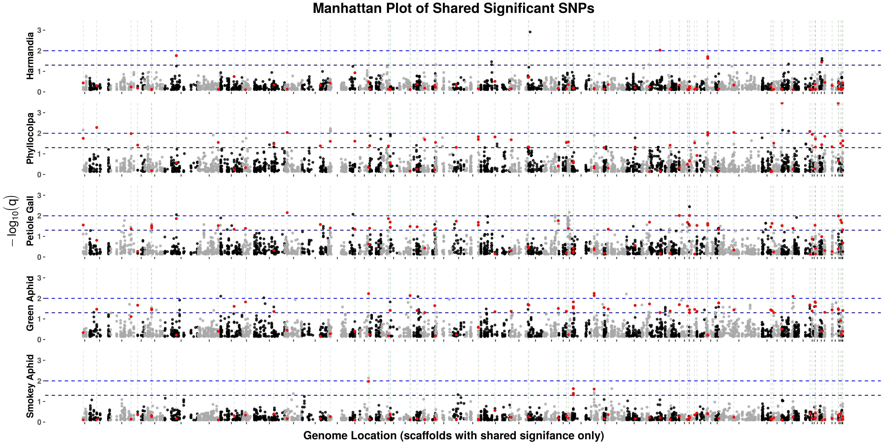

```{r setup, include = FALSE}
knitr::opts_chunk$set(echo = FALSE, message = FALSE, warning = FALSE,
                      eval.after = 'fig.cap')

knitr::opts_knit$set(root.dir = "../")
```

```{r load data, purl=FALSE}
library(dplyr);library(jpeg);library(png)
library(grid);library(gridExtra)
# load data provided in knitr parameter

# data(list = c("presentation-objects",
#               "GWA-annotated-candidate-table"))

vars.list <- data(list = params$data)
tree.traits <- read.table("data/phenos-and-covars.txt",header = TRUE)
starting.objects <- ls()
# ins.env <- new.env()
# load("~/Documents/projects/community-analysis-WisAsp/data/r-objects.RData",
     # envir = ins.env)
```

# Introduction
<!-- Much of this is taken from my thesis proposal -->

<!-- clear statement of problem(s) being addressed, why doing so is 
interesting/important, -->

Plant-insect interactions have traditionally been viewed through the lens of 
single species interactions (one plant and one insect) or interactions between 
whole communities. In particular, the effects of interspecific variation 
have been a focal point of community ecology in general (Power et al 1996)
and in studies of plant-insect interactions. However, the contribution of 
intraspecific variation was largely ignored. In recent decades, more attention 
has been given to the effects that variation in individual species can have on 
entire associated communities (Des Roches et al 2017; Koricheva and Hayes 2018)
and a recent meta-analysis showed that intraspecific trait variation
contributed significantly (25%,on average) to plant community trait variation 
world-wide (Siefert et al 2015). 

The interest in single-species effects on communities led to the development of 
a new field of study: community genetics. Proposed by Antonovics (1992), 
community genetics explores the effects of intraspecific variation on 
communities. This approach provides a means to understanding plant-insect 
interactions more completely than historical approaches. Research in this 
field has determined that different plant genotypes can have a strong 
influence on the composition and diversity of associated insect communities
by way of phenotypic trait expression (Whitham et al 2003, 2008; 
Wimp et al 2005; Bangert et al 2008; Meneses et al 2012; Gosney et al 2017).
**However, specific phenotypic traits, and suites thereof, that most influence 
insect communities remain poorly understood.** Even relatively simple insect 
communities, with only a few constituent taxa, are likely impacted by many host
plant traits. Yet most plant-insect community genetics studies focus on only 
genotype differences and broad-sense heritability of communities without 
investigating the mechanisms that drive those differences. Studies in which
phenotypic trait data have been collected have considered only a few traits,
leaving an incomplete understanding of the complete phenotypic mechanisms 
through which genetic differences act on communities (Hersch-Green et al 
2011; Crutsinger 2016).

<!-- Proposal: -->
<!-- To address phenotypic mechanisms of genotype-based community effects, we propose -->
<!-- to evaluate the combined effects that plant genetics and traits have in  -->
<!-- shaping associated insect herbivore communities, using a *Populus*  -->
<!-- experimental system. To this end, we will use a model-based approach to test  -->
<!-- the collective effects of (1) *Populus tremuloides* (aspen) genotype at various  -->
<!-- SNPs, (2) various aspen traits including size and defense traits, and (3)  -->
<!-- various environmental factors including weather and time on the abundance of  -->
<!-- 18 common insect species. -->

To address phenotypic mechanisms of genotype-based community effects, we aim
to evaluate the combined effects that plant genetics and traits have in
shaping associated insect herbivore communities, using a *Populus* experimental
system. In one step towards this end, we conducted a model-based, genome-wide association analysis
of *Populus tremuloides*. We evaluated the effects of genotype at various SNP
genomic markers on incidence of 18 common insect species, accounting a variety
of traits and environmental factors that are known to affect insect communities.

# Background
<!--  background specifying what has been done in this area -->

## Community genetics: state of the field

The success of herbivorous insects is largely determined by physical and 
chemical characteristics of their host plants, many of which are genetically 
mediated (heritable). Even before the advent of community genetics, 
ecologists recognized that species genetics can influence communities. 
These effects were termed extended phenotypes (EP) (Dawkins 1982; 
Antonovics 1992), a term that is still used by community genetics 
investigators (Whitham et al 2003). Though plant genes do affect insect 
communities, they do not do so directly as in typical phenotypic expression. 
Instead, communities respond to plant phenotypes that are mediated by genes.
Phenotypic traits, then, are the mechanisms of community genetic 
effects (Hersch-Green et al 2011; Crutsinger 2016). 

<!-- Needed? -->
<!-- Morphological and  -->
<!-- physiological plant traits that are likely to influence insect performance  -->
<!-- are those that affect quality and availability of the plant as a food  -->
<!-- resource.The available quantitiesof suitable host plant species can have  -->
<!-- significant impacts on individual insects and insect communities.  -->
<!-- Plant biomass is positively correlated with total insect abundance  -->
<!-- (Haddad et al 2001)and increasing leaf biomass is linked toincreasing  -->
<!-- insect herbivore abundance and species richness (Marques et al 2000). -->
<!-- Drivers of that trend includespecific heritable plant traits such as  -->

Additionally, expression of individual traits can be constrained by other 
traits. High levels of expression in one trait can predispose a plant to low 
expression of a different trait. Co-expression of chemical defense and growth, 
for example, are limited by allocational and genetic costs (Sampedro 2014; 
Eichenberg et al 2015; Züst and Agrawal 2017). Therefore, the interaction of 
heritable plant traits, in addition to individual traits, may be key to 
shaping insect communities.

Many studies have shown genotype-mediated  differences among plant-associated
insect communities (Whitham et al 2003; Johnson and Agrawal 2005; 
Bangert et al 2006; Wimp et al 2010) but few have incorporated genetics and
phenotypic expression to do so. Fewer still have used a wide range of
naturally co-occurring genotypes and respective phenotypic variation. Studies 
meeting these criteria are needed to understand the capacity of a natural 
system for community genetic effects (Crutsinger 2016). Additionally, 
specific plant phenotypes and genotypes to which insect communities are most 
sensitive have not been investigated thoroughly in a community genetics 
context (with notable exceptions for phenotypes such as chemical defenses: see 
Gosney et al, 2017) (Hersch-Green et al 2011; Crutsinger 2016). Chemical, 
physical, and phenological plant traits, the genetic information that regulates
these traits, and their interactions, all influence the structure and 
composition of associated insect communities. It is, therefore, important 
to investigate the effects of multiple plant traits with high levels of 
intraspecific variation. Furthermore, it is important to study plants from a 
population of genetically variable and naturally co-occurring genets of a 
foundation species such as aspen.

<!-- Necessary section? -->
## **Populus tremuloides** as a study system  

Trembling aspen is an ideal species for studying the interactions between 
genetics, traits, and insects because of its role in shaping insect communities.
Community genetic effects of plants in a system are most likely to occur when: 
1) The plant is a foundation species in the system, 2) the plant species has 
high levels of heritable variation in many traits, and 3) communities (insects)
that are associated with the plant have many potential members that are 
differentially sensitive to plant traits (Antonovics 1992; Bailey et al 2006; 
Whitham et al 2006; Bangert et al 2008; Crutsinger 2016). Aspen satisfy all 
these criteria.

Aspen are considered a foundation species in North America and support some of 
the most biologically diverse communities in the US (Mitton and Grant 1996; Kay 
1997; Madritch et al 2009; Kuhn et al 2011). The importance of aspen as a driver 
of biodiversity is even more pronounced when the scale at which it acts is 
considered; aspen is the most widely distributed tree species in all of North 
America (Little and Viereck 1971; Mitton and Grant 1996). Their extensive 
range necessitates interactions with a variety of different communities and 
locales and their high biomass potential allows them to support large 
communities.  

Aspen also exhibits a tremendous amount of phenotypic trait variation (Mitton 
and Grant 1996; Donaldson et al 2006; Lindroth and St Clair 2013) which 
provides an opportunity to study consequences of intraspecific variation for 
insect herbivore communities. Variation in traits means variation in quality 
and quantity of aspen as a food resource, which leads to variation in 
performance and abundance of aspen-associated insect herbivores (Hwang and 
Lindroth 1997; Lindroth et al 1999, 2007; Meneses et al 2012).  

Chemical defenses, for example, are among the most well-studied heritable aspen 
traits, in terms of variation and significance, that affect insect performance 
and influence communities (Erwin et al 1994; Lindroth et al 1999, 2007; Wimp 
et al 2007). Two predominant classes of aspen secondary metabolites are 
condensed tannins (CTs) and phenolic glycosides (PGs). Some variation in aspen 
traits such as PG and CT concentrations may be attributed to allocational, 
genetic, or phenological costs to other traits and phenotypic plasticity 
(Stevens and Lindroth 2005; Osier and Lindroth 2006). An example of plasticity 
can be seen with secondary metabolites of aspen which can be both constitutive 
and inducible (Osier and Lindroth 2001; Rubert-Nason et al 2015). This means 
that genotype and the environment (insect herbivores) interact to influence 
the expression of resistance compounds within a plant. Allocational costs to 
trait expression are likely contributors to the strong growth-defense tradeoffs 
documented in aspen (Hwang and Lindroth 1997; Donaldson et al 2005; Osier and 
Lindroth 2006; Cole et al 2016). 
<!-- uneeded -->
<!-- Many herbivorous generalist and specialist insects, spanning a wide range of  -->
<!-- taxa, utilize aspen as a food resource (Dickmann and Stuart 1983; Baranchikov  -->
<!-- et al 1989; Barker 2015). These aspen-associated herbivorous taxa span a range  -->
<!-- of feeding guilds that use different parts of the plant, in different ways. PGs  -->
<!-- in aspen, for example, are effective at reducing performance of generalists,  -->
<!-- especially lepidopteran generalists (Lindroth and Bloomer 1991; Hwang and  -->
<!-- Lindroth 1997; Roth et al 1997; Hemming and Lindroth 2000). However, the same  -->
<!-- compounds may be less effective, or even confer benefits, to specialists such  -->
<!-- as chrysomelid beetles (Donaldson and Lindroth 2004; Vigue and Lindroth 2010).  -->
<!-- Differential use of aspen, then, should result in different effects of  -->
<!-- quality-related traits, on different insect guilds and taxa, that manifest as  -->
<!-- community differences (Ali and Agrawal 2012; Mason et al 2017).  -->


# Methods
<!-- sketch on details of approaches that will be used -->

## Experimental Design

**WisAsp population:** the Lindroth research group has established the 
"Wisconsin Aspen Genetic Mapping Population" (WisAsp), a common garden 
plantation of *Populus tremuloides*, in 2010. WisAsp provides a unique 
opportunity to use many genetically and phenotypically diverse genets of aspen 
to test potential natural insect community differences. WisAsp exhibits high 
variation in many traits, including tree size, phenology, and chemical 
composition<!-- (Figure 1)-->.
Additionally, a wide range of generalist and specialist 
insect associates have become established at the common garden, including taxa 
from at least 7 orders and 125 species (Morrow, unpublished data; Barker, 2015). 
Common feeding guilds of the insects present at WisAsp include leaf-chewing, 
leaf-mining, leaf-galling, phloem-feeding, and wood-boring insects. The 
diversity of insects that utilize the WisAsp trees providesan opportunity to 
test the effects of specific traits on specific insect guilds and taxa as well 
as to test the overall effects on complex communities.

The garden contains 517 genotypes, with an average of three clonal replicate 
trees (ramets) per genotype for a total of 1,568 experimental ramets. The 
experimental trees are buffered from the external environment by a border of 255 
non-experimental trees. The trees from each genotype were planted as cuttings 
collected from a contiguous section of root material. Genotypes were collected 
from 13 counties throughout the state of WI<!-- (Figure 2)-->. 
The experimental ramets were arranged in a randomized complete block design 
with 4 blocks. Replants were conducted in 2011 and 2012 to replace trees that 
died in previous years. These replants resulted in replacement of 147 trees
belonging to diferent genets and an nonuniform age structure of the plot. 

## Data collection

Data were collected on tree genetics, traits, and associated insect communities.
Insect community data were collected by conducting visual surveys of 
insect herbivores on the lower third of each tree's canopy. The survey
boundary was chosen due to constraints imposed by the number of trees and large
size of each tree as well as the short duration of the surveys. Species
rarefaction estimates (Sanders 1968; Simberloff 1972; Gotelli and Colwell
2011) collected one week prior to the first insect survey showed no
difference in species richness among the top, middle, or bottom thirds of the
trees, justifying this census approach. Trees were surveyed for a
predetermined duration, with 3-minute minimum and 10-minute maximum caps, 
based on relative height, to estimate insect density (as a function of time).


<!-- Insects and traits-->
Of 104 total species of insects surveyed, 18 were identified as common (occured on 
$\geq 5\%$ of trees in each survey event) and will be used in the analysis.
Phytochemical analyses were conducted on leaf tissue from each ramet at each 
insect survey event. PGs were extracted from leaf tissue and quantified using 
UHPLC-mass spectrometry following methods of Abreu, modified by the Lindroth 
Lab (Abreu et al 2011; F Rubert-Nason et al 2017). CTs were extracted and 
quantified following the methods of Porter/Hagerman (Porter et al 1985; 
Hagerman and Butler 1989). Carbon and Nitrogen concentrations were quantified 
using near infrared spectroscopy (NIRS) with nitrogen analyzer calibration 
(Rubert-Nason et al 2013). All phytochemical extractions were done on leaves
that had been vacuume-dried for 48 hours. Other tree traits quantified (volume, 
basal area, number of flowers, sex, leaf area, bud break timing, and 
extra-floral nectaries) were done so using standard 
methods. 

<!-- SNPs -->
Coding-region genomic data (DNA) were collected for all Genets, (437 genets and 
1569 trees remained after filtering). The sequenced reads were alligned to 
scaffolds of a known reference genome of *Populus tremuloides*. Absolute 
locations of these scaffolds in the genome are currently unknown (though work to
resolve this is currently ongoing) and, therefore, only relative within-scaffold
locations of each marker are certain. Among our population, 114420 SNP markers
were identified, after applying a .05 minor allele frequency filter to remove 
potential false positives.

## Statistical Analyses

```{r, purl=TRUE}
SNP.N <- nrow(q.df) # 114420
insect.n <- nrow(sig.n.table) # 18
tree.n <- length(unique(tree.traits$SerialNo)) # 1569
genet.n <- length(unique(tree.traits$Genet)) # 437
av.rep <- round(sum(tree.traits %>% group_by(Genet) %>% tally() %>% 
                      transmute(n/4))/genet.n) # 3
model.n <- insect.n * SNP.N
```

We conducted a model-based case/control genome-wide association (GWA) study of 
*Populus tremuloides* (aspen) and incidence of `r prettyNum(insect.n,",")` 
common insect herbivore 
species. Incidence was measured on `r prettyNum(tree.n,",")` trees twice per 
summer 
(June and August) in 2016 and 2017 for a total of 4 surveys events. Sample size
here differs from the sample size presented in the 'Data collection' section
due either missing genetic data or the exclusion of border trees from insect
surveys. Among these trees, there are `r prettyNum(genet.n,",")` 
genetically unique individuals (genets), each with an average
of `r prettyNum(av.rep,",")` clonal replicates. 

We used generlaized linear mixed models (GLMM) to test the effects of 
aspen genotype (no. of alleles equal to reference alelle), at 
`r prettyNum(SNP.N,",")` SNP markers,
on insect presence. Unlike traditional GWA methods GLMMs allow for the 
ability to robustly test for genotype associations while accounting for plant 
traits already known to influence insect communities, variation within a genet, 
and temporal variation of traits and insect communities. GLMM methods are used 
in modern human genomic modeling (Maier et al, 2018) and their
use in plant systems is also ermerging (Kristensen et al, 2018). In
total, `r prettyNum(model.n,",")` GLMMs were created, one for each insect by 
SNP combination. These models were built and fitted using `lme4`, a mixed 
model package for the `R` statistical software package, 
and high-throughput computing 
resources (distributed computing) at the University of Madison - Wisconsin. 

The DNA reads of our trees (*Populus tremuloides*) were alligned to scaffold 
regions of the reference genome (*Populus tremula*). 
Genomomic position relationships among and within 
chromosomes is currently unknown for aspen. 
Therefore, locations of SNPs are only understood as
relative location within scaffolds. 
For this reason, SNPs were not pruned upstream for LD. 
Even with this limitation, Genes and expresson annotations for 
*Populus trichocarpa* and *Arabidopsis* can be imputed to a list of 
aspen SNPs to draw conclusions about function. The similarity in genes among
the 3 species is relatively high (see table \ref{tab:annotable}). Therefore, genes for
*P. trichocarpa* are likely to have very similar functions in aspen.

### GLMM

We consider a generalized linear mixed model (GLMM) for single-marker GWA. 
For each SNP marker, denote $p_{ijk_{g}}$ as the probability of observing 
non-zero count of insect type $i$ on tree $k$, belonging to genet $g$, 
during survey event $j$, the GLMM for a SNP has form:

$$\text{logit}(p_{ijk_{g}}) = \beta_0 +\alpha \text{G}_{g} + x_{jk_{g}}^\intercal\beta + \varepsilon_{g(j)}$$

where $\text{logit}(y)=\log\left(\frac{y}{1-y}\right)$,
$\text{G}_{g}$ is the SNP-specific genotype of genet $g$.
Genotype is defined here as the number of alleles that match the reference 
allele at the SNP location, i.e. additive coding of genotype is adopted. 
Moreover, $x_{jk_{g}}$ is the vector of normalized observed tree trait covariates, 
which include volume of the tree, average leaf area of the tree, standardized 
leaf area of the tree, degree days at which the tree's leaves became fully 
opened, average extra-floral nectaries per leaf of the tree, foliar condensed 
tannin concentration, salicinoid phenolic glycosides concentration, and age of 
tree. Since genets are nested under the four survey events, we consider 
$\varepsilon_{g(j)}$ as a random effect to introduce dependence between 
observations with same clonal replicate at the same survey period. To conduct
GWA, the two-tailed z-test p value of $\alpha$ in the GLMM is used to identify 
significant associations after pFDR correction.

### Computation
The `R` statistical software package is used for computing. 
Due to the nested random 
effect of the model, we use *lme4::glmer()* to fit the GLMM. Moreover, the 
computing task is parallelized using the Center for High Throughput Computing 
(CHTC) under the Department of Computer Sciences at the University of Madison - 
Wisconsin.

We then converted our p values into q values (Storey), controlling 
for a false discovery rate of .05. Then, for discovery purposes, we use a .05 
significance level cutoff for q values to identify significant associations. 
For a sample of `R` code see our supplemental file
["Specimen of R code"]("Evaluating the Effects of Genetics on Insect Communities - Speciment of R code.pdf").


# Results

## Significant Associations

```{r, purl=TRUE}
snps.n = length(running.sig.snps)
scaff.n = length(running.sig.scaf)
```

From the `r prettyNum(SNP.N,",")` total SNPs, we identified 
`r prettyNum(snps.n,",")` unique SNPs with significant associations 
($q < .05$) to incidence of at least one of our 
common insect species. Those SNPs were located on a total of 
`r prettyNum(scaff.n,",")` scaffolds. Table \ref{tab:sigtab} shows 
the breakdown of significant associations by all of our common insect species.

```{r insect meta data, include = FALSE, purl=TRUE}
insect.description <-  c(
  "free-feeding, specialist (salicaceae)", #grn.aph
  "leaf-galling, specialist (populus)", #pet.gal
  "leaf-rolling, specialist (salicaceae)", #phyl
  "leaf-galling, specialist (populus)", #harm
  "free-feeding, specialist (populus)", #smk.aph 
  "case-bearing, generalist", #CB
  "leaf-mining, specialist (populus)",#lomb
  "leaf-mining, specialist (salicaceae)",#CLM
  "leaf-mining, specialist (salicaceae)",#LEM
  "leaf-mining, specialist (populus)",#blot
  "leaf-mining, specialist (salicacea)",#weevil
  "leaf-mining, specialist (populus)",#black.beet
  "free-feeding, generalist",#LH
  "aphid-tending, non-herbivore",#Ants
  "free-feeding, specialist (populus)",#PGN
  "free-feeding, specialist (populus)",#ALB
  "free-feeding, specialist (populus)",#GS
  "scale insect, generalist"#CS
  )
# species <- metadata.insects %>% filter(R.Columns %in% common.insects) %>% 
#   select(R.Columns,Binomial)
# species$Binomial <- gsub(unlist(species$Binomial), pattern = "\\.",replacement = " ")                 
# species$Binomial <- gsub(species$Binomial, pattern = "\\d",replacement = "")
# species
sig.n.table$`insect description` <- insect.description
rownames(sig.n.table) <- gsub(rownames(sig.n.table),pattern = "Blackmine.*",
                              replacement = "Blackmine Beetle")
```

\scriptsize

```{r table 1 snp.n, fig.cap = caption, purl=FALSE}
caption = c("\\label{tab:sigtab}Insect descriptions, number of significant SNP associations per insect, and number of scaffolds on which those SNPs are located.")
knitr::kable(sig.n.table, caption = caption)
```

\normalsize

```{r sig n by insects, purl=TRUE}
ins.n = sum(sig.n.table$SNPs > 0) # 8
common.ins.n <- (unlist(snp.insects) %>% unique %>% length()) # 5
common.n <- nrow(incommon.snps) # 84
common.3.n <- nrow(incommon.snps %>% filter(n.assoc > 2)) # 4
```

Of the `r insect.n` common insects, `r ins.n` had significant associations.
Among those, `r common.n` SNPs were significantly 
associated with at least 2 insects (figure \ref{fig:multiman}). Because we are interested the effects of
the aspen genome on insect communities, these `r common.n` SNPs with shared 
significance will comprise our candidate list. We expect these insects to 
be affected by similar mechanisms, due to their similar feeding 
strategies (table \ref{tab:sigtab}). Therefore, it is very likely 
that those SNPs that affect multiple, similar insects are 
truly biologically significant. There is especially strong evidence for 
`r common.3.n` SNPs which were associated with 3 functionally similar insect 
species and which are located in the same genomic region 
(table \ref{tab:snptab}). This indicates that a true loci/gene of interest lies
wthin this genomic region. For Supplemental Materials see: 
[sup. materials](final-project_supplemental-mats.html). 

\scriptsize

```{r figure 1 multimanhattan, fig.cap = caption, out.width="120%", out.extra='angle=270', purl=FALSE}

caption <- c(paste("\\label{fig:multiman}Manhattan-style plots of 5 insects that share",
             "significant SNPs. The x-axis shows a filtered genomic region;", 
             "only scaffolds with shared-significant SNPs (red) are shown.",
             "q value based LOD scores are shown on the y-axis with dashed",
             "lines representing significance levels of .05 (dark blue) and",
             ".01 (blue). When an insect has a red SNP above the .05",
             "line, it shares this SNP association with another insect.",
             "Note that adjacent scaffolds on the x-axis (alternating black",
             "and grey) do not correspond to adjacent regions in the genome.",
             "Exact locations of scaffolds in the genome are currently unkown."
             ))
```

\normalsize


\scriptsize

```{r snp table, purl=TRUE}
int.snps <- incommon.snps %>% filter(n.assoc > 2) %>% select(SNP.name)

tab <- q.df %>% filter(SNP.name %in% int.snps$SNP.name) %>%
  select(SNP.name,qval.Harmandia,qval.Phyllocolpa,qval.Petiole.Gall)

bp <- as.numeric(gsub(int.snps$SNP.name,pattern = ".*:",replacement = ""))
rng <- range(bp)[2]-range(bp)[1]

knitr::kable(tab,col.names = c("SNP","Harmandia","Phyllocolpa","Petiole Gall"),
             caption = paste("\\label{tab:snptab}q values for SNPs with 3 associations.",
                              "All SNPs are located on the same scaffold and are",
                              "within",rng,"bases. They are almost certainly",
                              "in LD but suggest that there may be an important",
                              "locus in the region."))
```

\normalsize

## Gene Annotations

Here we provide a table of imputed gene annotations for genes of a congeneric 
to our reference genome, *Populus trichocarpa* (\ref{tab:annotable}). 
These annotations were extracted from the Populus Genome Integrative Explorer
(\href{ftp://plantgenie.org/Data/PopGenIE/Populus_tremula/v1.1/annotation}{PopGenie}
). All but 2 of these imputed genes are over 90% similar to the correspondingFor Supplemental Materials see: [sup. materials](final-project_supplemental-mats.html). 
genomic regions of our reference (%match in table \ref{tab:annotable}). This 
implies that gene function for the different *Populus* species considered should
be very similar and the annotations can be trusted, in general. Many of the 
descriptions of these genes are vague, however, some provide interesting insight
that appear to make biological sense. For instance, "sugar transport protein",
"protein TIC 62, chloroplastic", "oxireductase" (forms electron transport chains
in chloroplasts), and "glucuronate:xylan alpha" (contributes to cell wall 
structure) all seem biologically relevant to insects that obtain their food
from leaves with which their biologies are tightly associated. 

\tiny

```{r annotation table, out.width="100%",fig.align="center"}
library(dplyr)
table <- candidate.table %>% select(-n.assoc)
small.tab.names <- c("Potri Gene","%match","Descr.","avg allele freq", "insects")
caption <- paste("\\label{tab:annotable}*Populus trichocarpa* candidate gene list, with annotations,",
                 "and the insects with which they have significant associations.",
                 "'%match' is the similarity between the reference gene region",
                 "(*P. tremula*) and the annotated gene (*P. trichocharpa*)",
                 "'avg allele freq' is the proportion of minor alleles in",
                 "the population at the SNP of interest.")
knitr::kable(table, col.names = small.tab.names,caption = caption)
average.freq <- mean(candidate.table$mean_alleleFreq)
```

\normalsize

# Discussion

We provide clear evidence of aspen genes that influence the presence of
individual insects and groups thereof. Furthermore, the genes with significant
associations are independent of observed tree traits that are known to influence
insect incidence and abundance. Assotiations with multiple insects also seem
to be biologically meaningful in that they 1) are associated with groups of 
insects whose function is similar and whose expected sensitivity plant traits 
is similar and 2) have known function that are are biologically 
relevant to the groups of insects with which they are associated (some genes).

## Future Directions

Due to resource and time limitations, we were unable to perform thorough model 
selection steps with SNPs included, however the model that was selected had 
the best performance of similar models without SNP terms included. Further 
model selection steps should be done to determine if a better model exists.
We were also unable to compare this method to traditional approaches.
We would like to re-run the analyses in `PLINK` (without random effects), and 
`GEMMA` and compare results. 

However, we believe that this method provides a more robust method of 
identifying significant associations than simple linear regression techniques.
and BLUP regression methods (Kristensen et al, 2018).
In fact, we were able to identify far more significant associations with this 
method than a similar study on the same common garden (and the same insects) in
2015 that used the traditional approach (Barker et al, 2018).

We also have not yet had time to fully investigate the described functions for
each gene in our candidate list. This step is crucial to understanding 
the phenotypic mechanisms that are driving differences in insect 
incidence due to genotype. This will also help us to further determine 
if our statistically significant associations are biologically significant 
as well. This is the next immediate step for this project. 

Finally, these GWA results fit into a larger project that aims to understand
the intraspecific variation of aspen phenotype (including insect communities and
tree traits). Within the larger study we are attempting to explain variation in 
insect communities among aspen genets using measured traits and environmental 
factors. The genotype associations will give us a better understanding of
the genet-driven variation of insect communities that remains unexplained by 
these measured traits.

```{r save objects for presentation}
new.objects <- ls()[!ls() %in% starting.objects]
save(list = c(new.objects,"sig.n.table","incommon.snps"), file = "data/presentation-objects.RData")
```


\tiny

# References

Abreu IN, Ahnlund M, Moritz T, Albrectsen BR (2011) Uhplc-esi/tofms determination of salicylate-like phenolic gycosides in Populus tremula leaves. J Chem Ecol 37:857–870. doi: 10.1007/s10886-011-9991-7

Ali JG, Agrawal AA (2012) Specialist versus generalist insect herbivores and plant defense. Trends Plant Sci 17:293–302. doi: 10.1016/j.tplants.2012.02.006

Antonovics J (1992) Toward community genetics. In: Fritz RS, Simms EL (eds) Plant Resistance to Herbivores and Pathogens: Ecology, Evolution, and Genetics. University of Chicago Press, Chicago, Illinois, pp 426–449

Bailey JK, Wooley SC, Lindroth RL, Whitham TG (2006) Importance of species interactions to community heritability: a genetic basis to trophic-level interactions. Ecol Lett 9:78–85. doi: 10.1111/j.1461-0248.2005.00844.x

Bangert R, Lonsdorf E, Wimp G, et al (2008) Genetic structure of a foundation species: scaling community phenotypes from the individual to the region. Heredity (Edinb) 100:121–131. doi: 10.1038/sj.hdy.6800914

Bangert RK, Turek RJ, Rehill B, et al (2006) A genetic similarity rule determines arthropod community structure. Mol Ecol 15:1379–1391. doi: 10.1111/j.1365-294X.2005.02749.x

Baranchikov YN, Mattson WJ, Hain FP, Payne TL (1989) Forest insect guilds: patterns of interaction with host trees. Plant Physiol 415

Barbour MA, Fortuna MA, Bascompte J, et al (2016) Genetic specificity of a plant–insect food web: implications for linking genetic variation to network complexity. Proc Natl Acad Sci 113:2128–2133. doi: 10.1073/pnas.1513633113

Barker HL (2015) Wis(consin) asp(en) insect communities: a guide to the common insects on aspen (Populus tremuloides). https://aspeninsects.wordpress.com/2015/03/12/common-leaf-gallers/. Accessed 15 Dec 2017

Briggs EG, Kidd F, West C (1920a) A quantitative analysis of plant growth: part i. Ann Appl Biol 7:103–123. doi: 10.1111/j.1744-7348.1920.tb05107.x

Briggs EG, Kidd F, West C (1920b) A quantitative analysis of plant growth: part ii. Ann Appl Biol 7:202–223. doi: 10.1111/j.1744-7348.1920.tb05308.x

Chen M-S (2008) Inducible direct plant defense against insect herbivores: a review. Insect Sci 15:101–114. doi: 10.1111/j.1744-7917.2008.00190.x

Cheng Z-M, Tuskan GA (2009) Populus community mega-genomics: coming of age. CRC Crit Rev Plant Sci 28:282–284. doi: 10.1080/07352680903240933

Cole CT, Stevens MT, Anderson JE, Lindroth RL (2016) Heterozygosity, gender, and the growth-defense trade-off in quaking aspen. Oecologia 181:381–390. doi: 10.1007/s00442-016-3577-6

Crutsinger GM (2006) Plant genotypic diversity predicts community structure and governs an ecosystem process. Science (80- ) 313:966–968. doi: 10.1126/science.1128326

Crutsinger GM (2016) A community genetics perspective: opportunities for the coming decade. New Phytol 210:65–70. doi: 10.1111/nph.13537

Dawkins R (1982) The Extended Phenotype: The Gene as the Unit of Selection. Oxford University Press, Oxford, England

Des Roches S, Post DM, Turley NE, et al (2017) The ecological importance of intraspecific variation. Nat Ecol Evol. doi: 10.1038/s41559-017-0402-5

Dickmann DI, Stuart KW (1983) The culture of poplars in eastern north america. Michigan State Univ 168

Donaldson JR, Kruger EL, Lindroth RL (2005) Competition- and resource-meidated tradeoffs between growth and defensive chemistry in trembling aspen (Populus tremuloides). Plant Signal Behav 3:194–196. doi: 10.1111/j.1469

Donaldson JR, Lindroth RL (2004) Cottonwood leaf beetle (Coleoptera: Chrysomelidae) performance in relation to variable phytochemistry in juvenile aspen (Populus tremuloides michx.). Environ Entomol 33:1505–1511. doi: 10.1603/0046-225X-33.5.1505

Donaldson JR, Stevens MT, Barnhill HR, Lindroth RL (2006) Age-related shifts in leaf chemistry of clonal aspen (Populus tremuloides). J Chem Ecol 32:1415–1429. doi: 10.1007/s10886-006-9059-2

Eichenberg D, Purschke O, Ristok C, et al (2015) Trade-offs between physical and chemical carbon-based leaf defence: of intraspecific variation and trait evolution. J Ecol 103:1667–1679. doi: 10.1111/1365-2745.12475

Ellison AM, Barker-Plotkin AA, Foster DR, Orwig DA (2010) Experimentally testing the role of foundation species in forests: the harvard forest hemlock removal experiment. Methods Ecol Evol 1:168–179. doi: 10.1111/j.2041-210X.2010.00025.x

Erwin EA, Turner MG, Lindroth RL, Romme WH (1994) Secondary plant compounds in seedling and mature aspen ( Populus tremuloides ) in yellowstone national park , wyoming. Am Midl Nat 145:299–308

F Rubert-Nason K, Keefover-Ring K, L Lindroth R (2017) Purification and analysis of salicinoids. Curr Anal Chem 14:1–7. doi: 10.2174/1573411014666171221131933

Fisher RA (1921) Some remarks on the methods formulated in a recent article on “the quantitative analysis of plant growth.” Ann. Appl. Biol. 7:367–372

Gosney B, O’Reilly-Wapstra J, Forster L, et al (2017) The extended community-level effects of genetic variation in foliar wax chemistry in the forest tree eucalyptus globulus. J Chem Ecol 43:532–542. doi: 10.1007/s10886-017-0849-5

Haddad NM, Tilman D, Haarstad J, et al (2001) Contrasting effects of plant richness and composition on insect communities: a field experiment. Am Nat 158:17–35. doi: 10.1086/320866

Hagerman AE, Butler LG (1989) Choosing appropriate methods and standards for assaying tannin. J Chem Ecol 15:1795–1810. doi: 10.1007/BF01012267

Hemming JDC, Lindroth RL (2000) Effects of phenolic glycosides and protein on gypsy moth (Lepidoptera: Lymantriidae) and forest tent caterpillar (Lepidoptera: Lasiocampidae) performance and detoxication activities. Environ Entomol 29:1108–1115. doi: 10.1603/0046-225X-29.6.1108

Hersch-Green EI, Turley NE, Johnson MTJ (2011) Community genetics: what have we accomplished and where should we be going? Philos Trans R Soc B Biol Sci 366:1453 LP-1460. doi: 10.1098/rstb.2010.0331

Hwang SY, Lindroth RL (1997) Clonal variation in foliar chemistry of aspen: effects on gypsy moths and forest tent caterpillars. Oecologia 111:99–108. doi: 10.1007/s004420050213

Jansson S, Douglas CJ (2007) Populus : a model system for plant biology. Annu Rev Plant Biol 58:435–458. doi: 10.1146/annurev.arplant.58.032806.103956

Johnson MTJ, Agrawal AA (2005) Plant genotype and environment interact to shape a diverse arthropod community on evening primrose ( Oenothera biennis ). 86:874–885

Kay CE (1997) Is aspen doomed? J For 95:4–11

Koricheva J, Hayes D (2018) The relative importance of plant intraspecific diversity in structuring arthropod communities: a meta-analysis. Funct Ecol 0–2. doi: 10.1111/1365-2435.13062

Kuhn TJ, Safford HD, Jones BE, Tate KW (2011) Aspen (Populus tremuloides) stands and their contribution to plant diversity in a semiarid coniferous landscape. Plant Ecol 212:1451–1463. doi: 10.1007/s11258-011-9920-4

Lindroth RL, Bloomer MS (1991) Biochemical ecology of the forest tent caterpillar: responses to dietary protein and phenolic glycosides. Oecologia 86:408–413. doi: 10.1007/BF00317609

Lindroth RL, Donaldson JR, Stevens MT, Gusse AC (2007) Browse quality in quaking aspen (Populus tremuloides): effects of genotype, nutrients, defoliation, and coppicing. J Chem Ecol 33:1049–1064. doi: 10.1007/s10886-007-9281-6

Lindroth RL, Hemming JDC (1990) Responses of the gypsy moth (Lepidoptera: Lymantriidae) to tremulacin, an aspen phenolic glycoside. Environ Entomol 19:842–847

Lindroth RL, Hwang SY, Osier TL (1999) Phytochemical variation in quaking aspen: effects on gypsy moth susceptibility to nuclear polyhedrosis virus. J Chem Ecol 25:1331–1341. doi: 10.1023/A:1020926809508

Lindroth RL, St Clair SB (2013) Adaptations of quaking aspen (Populus tremuloides michx .) for defense against herbivores. For Ecol Manage 299:14–21. doi: 10.1016/j.foreco.2012.11.018

Little EL, Viereck LA (1971) Atlas of United States Trees: Conifers and important hardwoods, by EL Little, Jr. US Department of Agriculture, Forest Service

Maddox GD, Root RB (1990) Structure of the encounter between goldenrod (solidago altissima) and its diverse insect fauna. Ecology 71:2115–2124

Madritch MD, Greene SL, Lindroth RL (2009) Genetic mosaics of ecosystem functioning across aspen-dominated landscapes. Oecologia 160:119–127. doi: 10.1007/s00442-009-1283-3

Marques ESDA, Price PW, Cobb NS (2000) Resource abundance and insect herbivore diversity on woody fabaceous desert plants. Environ Entomol 29:696–703. doi: 10.1603/0046-225X-29.4.696

Mason CJ, Villari C, Keefover-Ring K, et al (2017) Spatial and temporal components of induced plant responses in the context of herbivore life history and impact on host. Funct Ecol 31:2034–2050. doi: 10.1111/1365-2435.12911

Matthews RW, Mackie ED, others (2006) Forest mensuration: a handbook for practitioners. Forestry Commission

Mattson WJ (1980) Herbivory in relation to plant nitrogen content. Annu Rev Ecol Syst 11:119–161

Meneses N, Bailey JK, Allan GJ, et al (2012) Arthropod community similarity in clonal stands of aspen: a test of the genetic similarity rule. Ecoscience 19:48–58. doi: 10.2980/19-1-3402

Mitton JB, Grant MC (1996) Genetic variation and the natural history of quaking aspen. Bioscience 46:25. doi: 10.2307/1312652

Nell CS, Meza-Lopez MM, Croy JR, et al (2018) Relative effects of genetic variation sensu lato and sexual dimorphism on plant traits and associated arthropod communities. Oecologia 1–12. doi: 10.1007/s00442-018-4065-y

Osier TL, Hwang SY, Lindroth RL (2000) Effects of phytochemical variation in quaking aspen Populus tremuloides clones on gypsy moth Lymantria dispar performance in the field and laboratory. Ecol Entomol 25:197–207. doi: 10.1046/j.1365-2311.2000.00245.x

Osier TL, Lindroth RL (2006) Genotype and environment determine allocation to and costs of resistance in quaking aspen. Oecologia 148:293–303. doi: 10.1007/s00442-006-0373-8

Osier TL, Lindroth RL (2001) Effects of genotype, nutrient availability, and defoliation on aspen phytochemistry and insect performance. J Chem Ecol 27:1289–1313. doi: 10.1023/A:1010352307301

Polis GA (1999) Why are parts of the world green? multiple factors control productivity and the distribution of biomass. Oikos 86:3–15

Pommerening A, Muszta A (2015) Methods of modelling relative growth rate. For Ecosyst 2:5. doi: 10.1186/s40663-015-0029-4

Porter LJ, Hrstich LN, Chan BG (1985) The conversion of procyanidins and prodelphinidins to cyanidin and delphinidin. Phytochemistry 25:223–230. doi: 10.1016/S0031-9422(00)94533-3

Power ME, Tilman D, Estes JA, et al (1996) Challenges in the quest for keystones. Bioscience 46:609–620. doi: 10.2307/1312990

R Core Team (2013) R: a language and environment for statistical computing

Roth S, Knorr C, Lindroth RL (1997) Dietary phenolics affects performance of the gypsy moth (Lepidoptera: Lymantriidae) and its parasitoid cotesia melanoscela (Hymenoptera: Braconidae). Environ Entomol 26:668–671. doi: 10.1093/ee/26.3.668

Rubert-Nason KF, Couture JJ, Major IT, et al (2015) Influence of genotype, environment, and gypsy moth herbivory on local and systemic chemical defenses in trembling aspen (Populus tremuloides). J Chem Ecol 41:651–661. doi: 10.1007/s10886-015-0600-z

Rubert-Nason KF, Holeski LM, Couture JJ, et al (2013) Rapid phytochemical analysis of birch (Betula) and poplar (Populus) foliage by near-infrared reflectance spectroscopy. Anal Bioanal Chem 405:1333–1344. doi: 10.1007/s00216-012-6513-6

Sampedro L (2014) Physiological trade-offs in the complexity of pine tree defensive chemistry. Tree Physiol 34:915–918. doi: 10.1093/treephys/tpu082

Senn J, Hanhimäki S, Haukioja E (1992) Among-tree variation in leaf phenology and morphology and its correlation with insect performance in the mountain birch. Oikos 63:215–222

Siefert A, Violle C, Chalmandrier L, et al (2015) A global meta-analysis of the relative extent of intraspecific trait variation in plant communities. Ecol Lett 18:1406–1419. doi: 10.1111/ele.12508

Stevens MT, Lindroth RL (2005) Induced resistance in the indeterminate growth of aspen (Populus tremuloides). Oecologia 145:298–306. doi: 10.1007/s00442-005-0128-y

Vigue LM, Lindroth RL (2010) Effects of genotype, elevated co2 and elevated o3 on aspen phytochemistry and aspen leaf beetle chrysomela crotchi performance. Agric For Entomol 12:267–276. doi: 10.1111/j.1461-9563.2010.00475.x

Whitham TG, Bailey JK, Schweitzer JA, et al (2006) A framework for community and ecosystem genetics: from genes to ecosystems. Nat Rev Genet 7:510–523. doi: 10.1038/nrg1877

Whitham TG, DiFazio SP, Schweitzer J, et al (2008) Extending genomics to natural communities and ecosystems. Science (80- ) 320:492–495

Whitham TG, Young WP, Martinsen GD, et al (2003) Community and ecosystem genetics: a consequence of the extended phenotype. Ecology 84:559–573. doi: 10.1890/0012-9658(2003)084[0559:CAEGAC]2.0.CO;2

Wimp GM, Martinsen GD, Floate KD, et al (2005) Plant genetic determinants of arthropod community structure and diversity. Evolution (N Y) 59:61–69

Wimp GM, Martinsen GD, Floate KD, et al (2010) Plant genetic determinants of arthropod community structure and diversity published by : society for the study of evolution stable url : http://www.jstor.org/stable/3448996 plant genetic determinants of arthropod community structure. 59:61–69

Wimp GM, Wooley S, Bangert RK, et al (2007) Plant genetics predicts intra-annual variation in phytochemistry and arthropod community structure. Mol Ecol 16:5057–5069. doi: 10.1111/j.1365-294X.2007.03544.x

Woinarski JCZ, Cullen JM (1984) Distribution of invertebrates on foliage in forests of south-eastern australia. Aust J Ecol 9:207–232. doi: 10.1111/j.1442-9993.1984.tb01359.x

Züst T, Agrawal AA (2017) Trade-offs between plant growth and defense against insect herbivory: an emerging mechanistic synthesis. Annu Rev Plant Biol 68:513–534. doi: 10.1146/annurev-arplant-042916-040856
